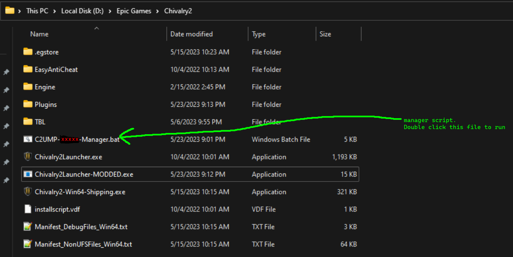

# C2UMP-manager
Auto-installer/uninstaller for the Chivalry 2 Unofficial Modding Project. This script is not expressly condoned by or associated with the creators of the C2UMP. I've taken care to prevent damaging of your game install, but give no garuntees that it won't happen, so use at your own risk! (If this does happen, contact me so I can fix the bug. A reinstall will fix everything)

# Instructions:

  Drag and drop the correct .bat file into your chivalry 2 install folder (where the Chivalry2Launcher.exe is located) and then double click it. If you have the steam version of chivalry, use the `C2UMP-Steam-Manager.bat`. If your have the Epic version of chivalry, use the `C2UMP-Epic-Manager.bat`. **make sure you use the correct one.** Follow the menu instructions from there. Menu options are selected using the keyboard by pressing the key corresponding to the option selected. For example, in the menu you select options by pressing one of the number keys.
  
# actions:
  
 **Install**: To install means to add the plugin loader to your game. This will allow you to use mods for chivalry 2. When the plugin loader is installed, you cannot join official servers. This will look for a disabled installation to enable, but if that isn't found it will download the latest version from the official C2UMP github and install that.
 
 **Disable**: Disabling the plugin loader sets your game install back to vanilla, allowing you to join official servers again. Mod-related files are put to the side so that they won't affect your game, but can be easily found by the install option if you want to re-install.
 
 **uninstall**: Same as disable, but actually deletes the plugin loader files. This will not delete the Plugins folder.
 
 **check installation status**: Does about what you would expect. Analyzes your game files to report whether or not the plugin loader is installed, if there is a disabled installation, and lists any plugins that are currently installed.
 
 **install plugins**: Allows the automatic installation of certain mods. Currently, only the c2server mod is available here. There is no automatic way to remove these mods, but it's as simple as deleting them from the Plugins folder (or the Plugins folder itself)

# Q&A

**Q:** How to upgrade C2 plugin loader to the latest version?  
**A:** run uninstall and then install. This will download the latest files.  

# Troubleshooting

**P:** When I try to install the mod loader, I get an error saying it couldn't find a launcher!  
**S:** This usually means that the .bat file is not in the correct location. (You are probably running it from your downloads folder!) Make sure you move it to the chivalry folder and then run it there.  

**P:** When I try to install the mod loader, I get an error saying it couldn't download.  
**S:** Check your internet connection before retrying.  

**P:** When I try to install, there is an error saying curl is not recognized!  
**S:** This script uses curl which comes pre-installed in windows since Windows 10, version 1803. You'll need to [get curl](https://stackoverflow.com/questions/9507353/how-do-i-install-and-use-curl-on-windows).  

**P:** When I try to run the game, it says "There is not usable authentication mechanism on this platform"  
**S:** You probably used the wrong version. (you have steam but used epic / vice versa) Uninstall using the manager you installed with, then delete it and replace it with the correct one. Then, install with the correct one and it should work.

# Planned features

1. Full mod auto-download and management support. (adding and removing mods/assets, disabling them, etc) Right now, it only allows adding the c2server mod and doesn't support automatically removing it.
2. potentially using uPnP to forward a port for the chivalry server. This will be low-priority.
